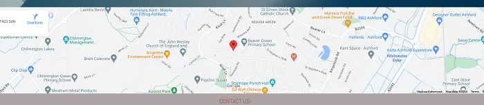
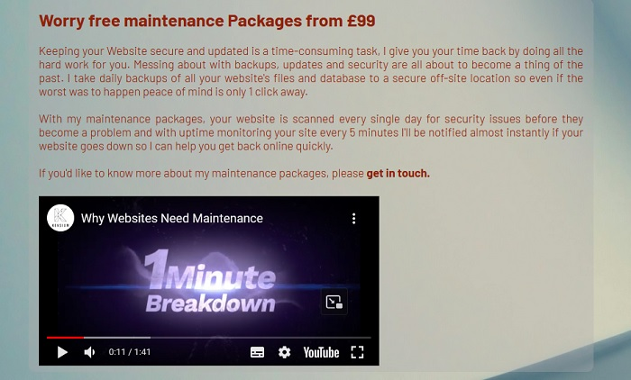

# milestone1
## Milestone project 1 - static web development

<a href="https://ocyrus47.github.io/milestone1/" target="_blank"> Link to milestone 1 project / OL Designs </a>

This is a responsive website for anyone who is looking to design or build a new or maintain their current custom website. The website features information and best practice youtube videos from industry experts for interested individuals looking to hire OL Designs (me) for the purpose of designing, developing or mainting their website. The website contains 6 pages in total which are home/index, services, contact, Design & UX, Web Development and Web Maintainance page. The primary goal of the website is to lead potential customers to making first contact with the web developer via the contact page and offer them industry knowledge for web design, development and maintainance.

<ol>
    <li>Home/index - contains main navigation/menu at top with company logo (link to home page) with animaiton zooming forwards.</li>
    <li>services - contains 2 sections. The Hire me button linking to contact us page and the services containers linkingto their respective pages for more details</li>
    <li>contact - contains contact details with links to watsapp and email. Also contains forms for potential customers to query for required services.</li>
    <li>Design & UX - contains video on how to choose a web designer and profile of clientele interested in the service.</li>
    <li>Web Development  - contains video on best practice for web development and profile of clientele interested in the service.</li>
    <li>Web Maintainance - contains video on why you need to maintain your website and profile of clientele interested in the service.</li>
</ol>

## Scope

The website takes into consideration the work required to build and maintain a responsive website for startups, businesses and agencies. Understanding the line of business for the project and the emotion driven decisions for the potential customers for startup or the requirements required by agencies, this website is designed to have fewest number of steps to bring their questions and projects in front of the service provider. 

Business goal for this website are:

<ul>
    <li>Build a solid brand awareness.</li>
    <li>Provide industry standard guide and best practice for web design, development and necessity for web waintainance to potential customers.</li>
    <li>Engaging UX design to keep potential customers engaged to ultimately reach out for first point of contact for advice and/or service.</li>
    <li>Drive sales in form of first contact via contact page and eventually lead to project and requirements via call or meeting.</li>
</ul>

Customer goal for this website are:

<ul>
    <li>Easy and clear to navigate and gain information for web design, development and maintanance services.</li>
    <li>Quick and easy steps required to reach the service provider.</li>
    <li>Engaging and easy UX to categorise their profile for required service.</li>
</ul>

## UX

Ideal customers for the business are:

<ul>
    <li>English speaking</li>
    <li>Startups, SME or Large companies and Agencies</li>
    <li>Looking to start new project or hiring for an ongoing project</li>
</ul>

Visitors to the website are:

<ul>
    <li>Looking for freelances and developers to design, build and maintain their custom websites.</li>
    <li>Gaining information on industry standard and best practices for choosing companies to build and maintain their custom websites</li>
</ul>

## User stories

<ol>
    <li>As a new visitor, I want to easily navigate throught the website to find the information quickly</li>
    <li>As a new visitor, I don't want the website to provide me with informaiton on service provided in engaging fashion</li>
    <li>As a new visitor, I want the website to give me guide lines before hiring a web developer.</li>
    <li>As a potential client, I want to reach out to the service provider as quickly as possible with minimun interruptions or steps involved.</li>
    <li>As a potential client, I want to discuss my project plan with the point of contact quickly and effeciently.</li>
    <li>As a potential client, I want to select the different service options provided (Web Design, Web Development, Web Maintainance).</li>
    <li>As a returning client, I want to be able to select the service option required (Web Design, Web Development, Web Maintainance) for meeting/call back.</li>
    <li>As an observer or potential client, I want to follow the social media for real time updates and reviews.</li>
</ol>

## Wireframes

1. [Home Page](assets/images/Wireframe%20-%20Home.png 'link to Home wireframe image')
2. [Services Page](assets/images/Wireframe%20-%20Services.png 'link to Services wireframe image')
3. [Contact Page](assets/images/Wireframe%20-%20Contact.png 'link to Contact wireframe image')

### Strategy

My goal in the design was to make it as easy as possible to access information on the site while striving for a minimalist and engaging UX design.

## Technologies

<ul>
    <li>HTML 5</li>
    <li>CSS</li>
    <li>Font Awesome</li>
    <li>Google Fonts</li>
    <li>Youtube Embed video</li>
    <li>Media Queries</li>
</ul>

## Features

### Existing features

#### Header and footer:

There is a header in every page with company logo linking back to home/index page to the right for easy navigation and home, service, contact page to the right. There is also a footer in every page with copyright information and social media icons zooming in and changing color upon mouse over and linking to the respective sites.

#### Home:

The site uses key frame animation to zoom the home page background image forwards.

#### Service:

Service page has call to action (hire me) button taking to contact page. Service page also has 3 containers zooming forward to highlight the selection on mouse over taking the user to the respective page in new tab and each page contains youtube embed videos.

#### Contact:

Contact page has a link for users to watsapp applicaiton and email client link in contact info opening in a seperate tab. There is also a drop down menu for user to choose how they found the site. The bottom of form contains a send button. Not completing the form and trying to submit will result in prompting the user to fill in the required field. 

#### Feature to implement in the future:

<ul>
    <li>Add protfolio page with completed projects.</li>
    <li>Add scrollSpy feature in Bootstrap with an extra JavaScript function to create a 'smooth scrolling' effect.</li>
    <li>Add animation to the icon in services page for each service on hover effect.</li>
    <li>GDPR compliant pop-up screen - Allows new visitors to the website to approve or deny the processing of their personal data. - Javascript Needed</li>
    <li>FAQ page, table with FAQs and dropdown buttons to view answers - Gives potential clients easy to find answers to their common questions. - Javascript Needed for dropdown functionality.</li>
</ul>

## Testing

This website code was validate by using **W3C CSS Validation Service** and **W3C Markup Validation Service**.

[W3C Markup Valication Service](https://validator.w3.org/ 'link to Markup validator')

[W3C CSS Validation Service](https://jigsaw.w3.org/css-validator/ 'link to CSS validator')

Client stories testing:

Navigation path through the website:

<ul>
    <li>Home -> Services -> (Web and UX Design/Web Development/Web Maintainance) -> Contact</li>
    <li>Service page offers 3 paths where the user will have option to select any of the service option to take them to the selected page</li>
</ul>

### Manual testing of all functions and features in the website:

#### Menu Bar - Test completed 

Top of every page in the website. Tested for links to correct pages all work as expected. All links opens selected page in a new tab.

Logo is linked to the home page and on mouse clicks open the home page in a new tab.

#### Home Page - Test completed 

<ol>
    <li>Minimal design to with a tagline and a bit of information about what I do.</li> 
    <li>Animated background image zooming forwards for engaging UX.</li>
</ol>

#### Service Page - Test completed 

<ol>
    <li>Tagline zooming backwards.</li>
    <li>Button titled "Hire me" has zoom out effect on hover and opens up contact page in new tab on click.</li>
    <li>Web and UX Design container has zoon forward effect on hover and opens a the Web and UX Design page in new tab on click</li>
    <li>Web Development container has zoon forward effect on hover and opens a the Web Development page in new tab on click</li>
    <li>Web Maintainance container has zoon forward effect on hover and opens a the Web Maintainance page in new tab on click</li>
</ol>

#### Contact Page - Test completed 

<ol>
    <li>Contact details include watsapp, on mouse it take the user to watsapp site in a new tab.</li>
    <li>Contact details include Email, on mouse it take the user to open email client/app.</li>
    <li>Contact details include drop down menu, optional requirement for user to selet when reaching out</li>
    <li>Input fields has a required requirement for submitting details</li>
    <li>Radio options has a required requirement for submitting details </li>
    <li>Button has a zoom forward effect on hover</li>
    <li>Google map showing the correct pin for address</li>
</ol>

#### Web & UX/Web Development/Web Maintainance Page - Test completed 

<ol>
    <li>Youtube embed video to fit within the container</li>
    <li>Youtube embed video will require user to click to play</li>
    <li>Links for "Hear from you" and "get in touch" to contact page.</li>
</ol>

### Footer - Test completed 

<ol>
    <li>Social icon enlarge and change color on hover effect</li>
    <li>Social icon on mouse click open a new tab for the website/application</li>
</ol>

## Deployment

This project was developed using Gitpod IDE. Commits to git and push to Github were made using the built in function in Gitpod. In order for the site to deploy correctly on GitHub pages, the landing page must be named index.html.

To run the code within you IDE locally eg, Gitpot, follow the steps below:

<ol>
<li>Follow this link to the <a href="https://github.com/Ocyrus47/milestone1" target="_blank">Project GitHub repository.</a></li>
<li>Under the repository name, click "Clone or download".</li>
<li>In the Clone with HTTPs section, copy the clone URL for the repository.</li>
<li>In your local IDE open the terminal.</li>
<li>Change the current working directory to the location where you want the cloned directory to be made.</li>
<li>Type git clone, and then paste the URL you copied in Step 3.</li>
<li>Press Enter. Your local clone will be created.</li>
</ol>

To cut ties with this GitHub repository, type git remote rm origin into the terminal.

# Credits

All content in this website was written by me. 

### Media

Company logo was created from <a href="https://www.freelogodesign.org/" target="_blank" alt="Freelogo Design website link"> Freelogo Design.</a>

All background image was taken from <a href="https://www.pexels.com/" target="_blank" alt="Pixel website link"> Pixel </a>.

Images in services page was used from <a href="https://www.flaticon.com/" target="_blank" alt="Flaticon website link"> Flaticon.</a>

Completed icon for readme was resized from <a href="https://imageresizer.com/" target="_blank" alt="Image Resizer website link"> Image Resizer.</a>

# Acknowledgements

As a student of code institue persuing Web Development I wanted to use the skills and knowledge through the course to create a Website offering Web development services with an aim to build more diverse projects for surrounding startups and business and add to my portfolio. Projects interested will be either paid or pro-bono with main goal of building large portfolio for future.

### This is for educational purpose